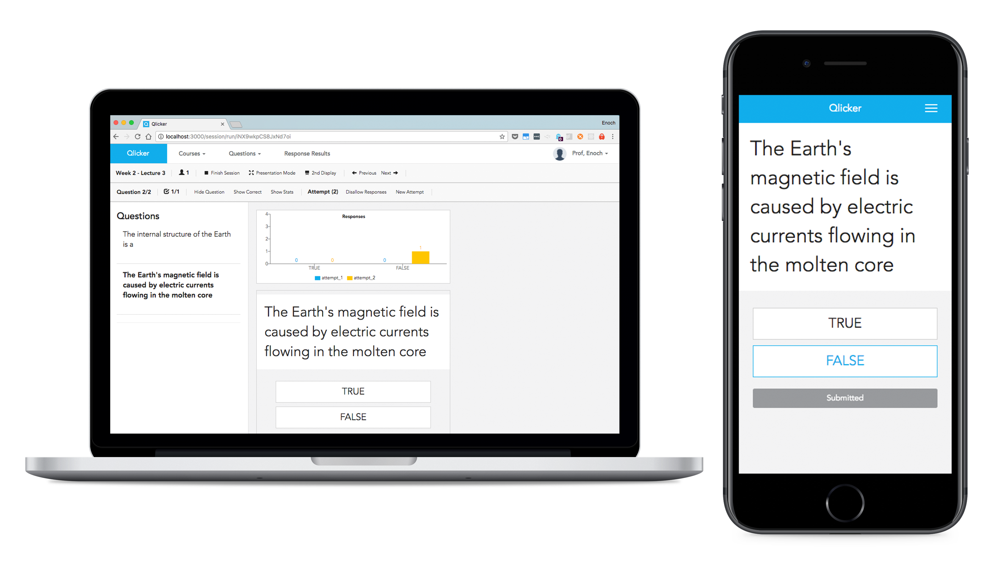

# QLICKER
Open Source Clicker - CISC498

[](https://circleci.com/gh/qlicker/qlicker)
[](https://github.com/qlicker/qlicker/issues)
[](https://www.gnu.org/licenses/gpl-3.0.en.html)
[](http://standardjs.com/)

[](https://rawgit.com/qlicker/qlicker/master/docs/.jsdocs/index.html)
[](https://github.com/qlicker/qlicker/tree/master/docs)


Qlicker is an application that will make it easier for professors to integrate student participation in classes. This involves a mobile-capable web application that can be used by students on their own devices as an alternative to the very common and hardware based iClicker system.



## Using Qlicker

[Visit User Guide](https://qlicker.github.io)

## Running Qlicker

1. Install meteor
```
curl https://install.meteor.com/ | sh 
```

2. Clone the repo, and install the node packages.
```
meteor npm install
```

Note, if you use `npm install` instead of `meteor npm install`, you will need to manually delete the `node_modules` directory, and then run `meteor npm install`.

3. Run the program.
```
meteor
```

To run tests locally
`npm run test:unit-watch` or `npm run test:app-watch`

## Development and Contributing

This application is built using the meteor web framework. Meteor is a node.js web framework that allows for tight integrator of server and client side javascript. It integrates with mongodb to provide seamless data model integration using pub-sub to automatically render changes on the client side. React was chosen over blaze and angular as the frontend user interface library. 

When developing, please adhere to meteor and react opinions as well as following the [Javascript Standard Code Style](http://standardjs.com). 

Changes will be merged into master after PR review.

## Deployment

Build and bundle using `meteor build`. Deploy node app and configure mongodb accordingly.

### Docker deployment
We provide a docker image of qlicker that is built using jshimko/meteor-launchpad:latest. This docker image does not have mongo built in it. Access it at:
```
docker pull qlicker/qlicker:v1.2.0
```
To run the image, you must specify at least ROOT_URL and MONGO_URL environment variables (credentials here are presented using host environment variables):
```
docker run -d \
-e ROOT_URL=http://localhost:3000 \
-e MONGO_URL=mongodb://${DBADMINUSER}:${DBADMINPWD}@db:27017/${DBNAME}?replicaSet=${REPLICASETNAME} \
-e MONGO_OPLOG_URL=mongodb://${DBOLUSER}:${DBOLPWD}@db:27017/local?authSource=admin \
-e MAIL_URL=${MAIL_URL}\
-e STARTUP_DELAY=10\
-p 3000:3000 qlicker/qlicker:v1.2.0
```
You do not need to use a replicaset, or specifiy an oplog. The MAIL_URL is required if you want the app to be able to send emails (verify accounts in non-SSO setting, forgot password, etc.). The STARTUP_DELAY will delay the start of the app twice by the specified amount in seconds (20 seconds in above), in case you need proxy and mongo containers to start first.

In production, you should of course place a proxy in front of the app container to enforce SSL. 

You can build your own docker image as follows:

Clone the repository:
```
git clone https://github.com/qlicker/qlicker.git
```

Switch to a tagged version of the app
```
cd qlicker
git checkout v1.1.3
```

Create a Dockerfile in the top level of the directory downloaded by git (called qlicker by default), with the single line:
```
FROM jshimko/meteor-launchpad:latest
```

Build the image (this will build it with a mongo database, not recommended for deployment):
```
docker build --build-arg TOOL_NODE_FLAGS="--max-old-space-size=2048" \
--build-arg INSTALL_MONGO=true  -t yourname/qlicker:v1.1.3 .
```

Run it using the local version of mongo:
```
docker run -d \
-e ROOT_URL=http://localhost:3000 \
-e METEOR_SETTINGS={"bucket":"a","AWSRegion":"somehwere","AWSAccessKeyId":"yourkey","AWSSecretAccessKey":"yoursecretkey"}
-p 3000:3000 yourname/qlicker:v1.1.3
```

Note that the versions of the app v1.1.3 or earlier require METEOR_SETTINGS to be specified for Amazon S3 storage (new versions allow this to be set in the admin interface). 

The details on building the image are documented in https://github.com/jshimko/meteor-launchpad.

In production, you should specify the environments variable for a database (either separate containers, or from a service), and place a proxy in front of the app container so that SSL can be enforced. 


